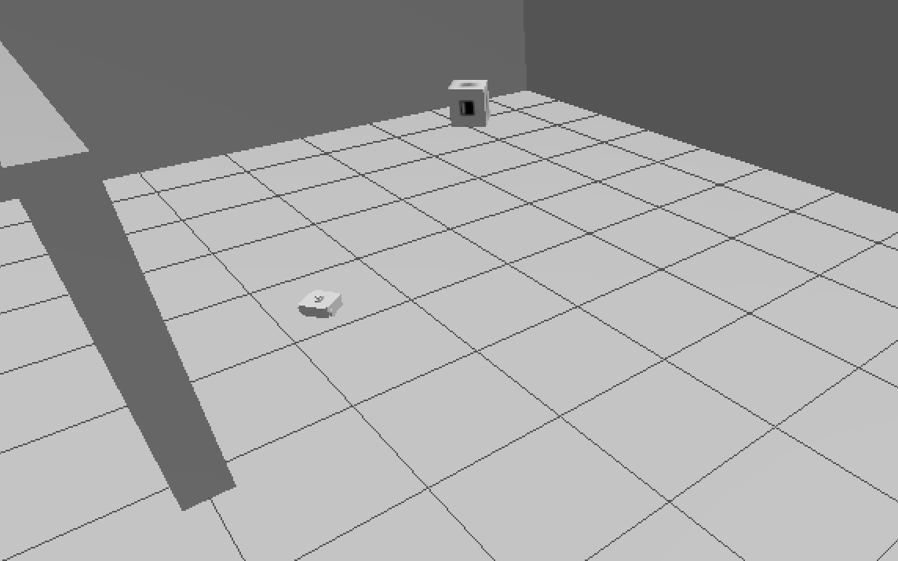

# ArUco Marker Navigation and Photography System

A ROS2 project that autonomously explores an environment to detect ArUco markers, then navigates to photograph each marker in ID order using Nav2 navigation stack.



## Overview

This project implements an autonomous navigation system that:
1. Navigates to four predefined waypoints in the environment
2. Performs 360° scans at each waypoint to detect all ArUco markers
3. Records the world positions of detected markers
4. Navigates to each marker in ascending ID order (lowest ID first)
5. Takes and saves annotated photographs of each marker

## Project Structure

```
assignment_2/
├── assignment_2/
│   ├── __init__.py
│   └── aruco_navigator.py       # Main navigation node
├── launch/
│   └── assignment_2_launch.py   # Launch file for simulation
├── maps/
│   └── map.yaml                 # Pre-built map for navigation
├── world/
│   └── simple_world.sdf         # Gazebo world with markers
├── package.xml
├── setup.cfg
└── setup.py
```

## Dependencies

- ROS2 Jazzy
- Gazebo Harmonic
- Nav2 navigation stack
- TurtleBot3 packages
- `aruco_opencv` package for marker detection
- `nav2_simple_commander` for navigation control
- Python packages:
  - `tf_transformations`
  - `opencv-python` (cv2)
  - `numpy`

## Installation

1. Install TurtleBot3 packages:
```bash
sudo apt install ros-jazzy-turtlebot3*
```

2. Install Nav2:
```bash
sudo apt install ros-jazzy-navigation2 ros-jazzy-nav2-bringup
```

3. Install ArUco detection:
```bash
sudo apt install ros-jazzy-aruco-opencv ros-jazzy-aruco-opencv-msgs
```

4. Clone and build the package:
```bash
cd ~/ros2_ws/src
git clone <your-repository-url>
cd ~/ros2_ws
colcon build --packages-select assignment_2
source install/setup.bash
```

## Environment Setup

The simulation environment (`simple_world.sdf`) contains:
- Four ArUco markers positioned at the corners:
  - Marker 0: Northwest (-8.1, 9.0)
  - Marker 1: Northeast (8.2, 9.0)
  - Marker 2: Southeast (8.6, -8.9)
  - Marker 3: Southwest (-8.0, -8.9)
- Walls forming the perimeter
- Indoor environment suitable for camera-based detection

## Node: aruco_navigator

### Functionality

The node implements a state machine with the following states:

1. **INIT**: Waits for Nav2 to become fully active
2. **EXPLORE_WAYPOINTS**: Initiates navigation to the next waypoint
3. **NAVIGATING_TO_WAYPOINT**: Monitors progress to waypoint
4. **ROTATE_SCAN**: Performs 360° rotation to scan for markers
5. **GO_TO_MARKER**: Starts navigation toward target marker
6. **NAVIGATING_TO_MARKER**: Monitors progress to marker
7. **CENTER_AND_PHOTO**: Takes annotated photograph of marker
8. **DONE**: Mission complete

### Exploration Strategy

The robot visits four waypoints in sequence to ensure complete coverage:
- **Southwest**: (-6.0, -6.0)
- **Northwest**: (-6.0, 6.0)
- **Northeast**: (6.0, 6.0)
- **Southeast**: (6.0, -6.0)

At each waypoint, the robot rotates 360° for 12 seconds to scan for all visible markers.

### Topics

**Subscribed:**
- `/odom` (`nav_msgs/Odometry`) - Robot position and orientation
- `/camera/image_raw` (`sensor_msgs/Image`) - Camera feed from TurtleBot3
- `/aruco_detections` (`aruco_opencv_msgs/ArucoDetection`) - ArUco marker detections

**Published:**
- `/cmd_vel` (`geometry_msgs/Twist`) - Direct velocity commands (for scanning rotation)
- `/aruco_marked_image` (`sensor_msgs/Image`) - Annotated photos with marker information

### Parameters

- `angular_speed`: Rotation speed during scanning (default: 0.5 rad/s)
- `linear_speed`: Forward movement speed (default: 0.2 m/s)
- `photo_distance`: Distance to maintain from marker for photo (default: 1.5 m)
- `scan_duration`: Duration of 360° scan at each waypoint (default: 12.0 s)
- `photo_output_dir`: Directory for saving photos (default: `/tmp/aruco_photos`)

## Usage

### Running the Complete System

The system requires two terminals for optimal operation:

**Terminal 1** - Launch Nav2 with TurtleBot3 simulation:
```bash
cd ~/ros2_ws
source install/setup.bash
export TURTLEBOT3_MODEL=waffle
ros2 launch assignment_2 assignment_2_launch.py
```

This starts:
- Gazebo simulation with the world
- TurtleBot3 Waffle robot
- Nav2 navigation stack with localization
- ArUco marker detection node

**Terminal 2** - Launch the navigation node:
```bash
cd ~/ros2_ws
source install/setup.bash
ros2 run assignment_2 aruco_navigator --ros-args -p use_sim_time:=True
```

> **Note**: Wait 30-60 seconds after launching Terminal 1 to ensure Nav2 is fully initialized before starting Terminal 2.

### Alternative: Single Launch File

You can uncomment the `aruco_navigator_node` line in `assignment_2_launch.py` to launch everything together, but the two-terminal approach provides better control and visibility of the navigation node's status.

### Monitoring the System

View saved photos:
```bash
ls -lh /tmp/aruco_photos/
# Photos are named: marker_000.jpg, marker_001.jpg, etc.
```

Monitor navigation status:
```bash
ros2 topic echo /aruco_detections
```

View marked images in real-time:
```bash
ros2 run rqt_image_view rqt_image_view /aruco_marked_image
```

Check node logs:
```bash
ros2 node list
ros2 node info /aruco_navigator
```

## Algorithm Details

### Phase 1: Exploration and Detection

1. **Initialization**
   - Node waits for Nav2 lifecycle to reach ACTIVE state
   - Uses `BasicNavigator.waitUntilNav2Active()` to ensure system readiness
   - Prevents premature goal submission that could be rejected

2. **Waypoint Navigation**
   - Sequentially visits all four corner waypoints
   - Uses Nav2's `goToPose()` for autonomous navigation
   - Monitors navigation status with `isTaskComplete()` and `getResult()`

3. **Marker Scanning**
   - At each waypoint, performs 360° rotation for complete coverage
   - Continuously processes `/aruco_detections` during rotation
   - Calculates marker world positions from camera frame detections:
     ```python
     distance = sqrt(marker_x² + marker_z²)
     angle_to_marker = atan2(marker_x, marker_z)
     world_x = robot_x + distance * cos(robot_yaw + angle_to_marker)
     world_y = robot_y + distance * sin(robot_yaw + angle_to_marker)
     ```
   - Maintains running average of positions for multiple detections

4. **Fallback Mechanism**
   - If no markers detected, uses hardcoded positions from world file
   - Ensures mission can complete even with detection issues

### Phase 2: Marker Photography

1. **Sorting and Planning**
   - Sorts all detected markers by ID (ascending order)
   - Creates visit sequence: [0, 1, 2, 3, ...]

2. **Approach Strategy**
   - Calculates approach position to maintain `photo_distance` from marker
   - Computes orientation to face the marker directly
   - Uses Nav2 to navigate to approach pose

3. **Photography**
   - Captures current camera image
   - Annotates with:
     - Marker ID
     - Photo sequence number (e.g., "Photo 2/4")
     - Timestamp
     - Green crosshair and circle overlay
   - Saves as `marker_XXX.jpg` in output directory
   - Publishes annotated image to `/aruco_marked_image`

### Coordinate Transformation

The system transforms marker detections from camera frame to world frame:

```
Camera Frame (Z-forward, X-right):
- marker.pose.position.x → horizontal offset
- marker.pose.position.z → distance from camera

World Frame (map):
- Uses robot odometry for current position
- Applies rotation based on robot yaw
- Accumulates multiple detections for accuracy
```

### State Machine Flow

```
INIT → Wait for Nav2
  ↓
EXPLORE_WAYPOINTS → Select next waypoint
  ↓
NAVIGATING_TO_WAYPOINT → Monitor navigation
  ↓
ROTATE_SCAN → 360° scan for markers
  ↓ (repeat for all waypoints)
GO_TO_MARKER → Navigate to marker by ID
  ↓
NAVIGATING_TO_MARKER → Monitor approach
  ↓
CENTER_AND_PHOTO → Capture and save image
  ↓ (repeat for all markers)
DONE → Mission complete
```

