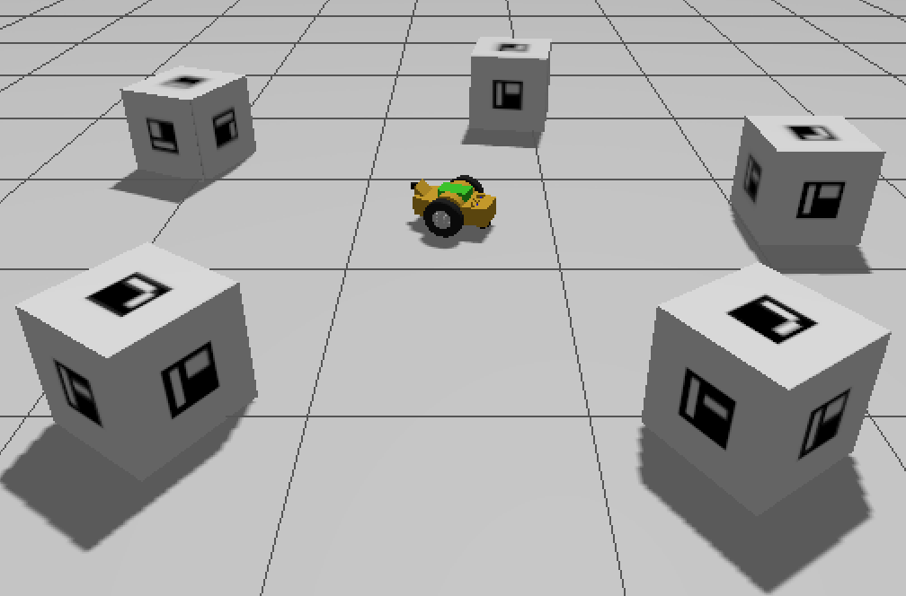

# ArUco Marker Finder Project

A ROS2 project that autonomously detects and navigates to ArUco markers in a Gazebo simulation environment.



## Overview

This project implements an autonomous robot behavior that:
1. Scans the environment by rotating to detect all ArUco markers
2. Identifies the marker with the lowest ID
3. Navigates towards and centers on that target marker
4. Publishes a marked image with the target highlighted

## Project Structure

```
assignment_1/
├── assignment_1
│   ├── __init__.py
│   └── aruco_marker_finder.py
├── launch
│   └── assignment_1.launch.py
├── package.xml
├── resource
│   └── assignment_1
├── rviz
│   └── my_config.rviz
├── setup.cfg
├── setup.py
├── test
│   ├── test_copyright.py
│   ├── test_flake8.py
│   └── test_pep257.py
└── worlds
    └── my_world.sdf
```

## Dependencies

- ROS2 (Jazzy)
- Gazebo Sim
- `bme_gazebo_sensors` package
- `aruco_opencv` package

## World Setup

The simulation world (`my_world.sdf`) contains:
- 5 ArUco box markers placed at different locations
- A ground plane

## Node: aruco_marker_finder

### Functionality

The node operates in a state machine with four states:

1. **SCANNING**: Rotates in place to detect all markers in the environment
2. **APPROACHING**: Moves towards the target marker (lowest ID)
3. **CENTERING**: Fine-tunes position to center the marker in camera view
4. **DONE**: Publishes marked image and stops

### Topics

**Subscribed:**
- `/aruco_detections` (`aruco_opencv_msgs/ArucoDetection`) - ArUco marker detections
- `/camera/image` (`sensor_msgs/Image`) - Camera feed

**Published:**
- `/cmd_vel` (`geometry_msgs/Twist`) - Robot velocity commands
- `/aruco_marked_image` (`sensor_msgs/Image`) - Image with target marker highlighted

## Usage

### Building the Package

```bash
cd ~/ros2_ws
colcon build --packages-select assignment_1
source install/setup.bash
```

### Running the Simulation

Launch the complete system (Gazebo, robot, ArUco detector, and finder node):

```bash
ros2 launch assignment_1 assignment_1.launch.py
```

This will:
- Start Gazebo with the custom world
- Spawn the robot with camera sensor
- Launch the ArUco detection node
- Start the marker finder node
- Open RViz with the configured view

### Monitoring

The marked image with the target ArUco marker highlighted is visible in RViz on the `/aruco_marked_image` topic. Make sure to add an Image display in RViz and set the topic to `/aruco_marked_image` if it's not already configured in the provided RViz config file.

You can also view the marked image in a separate window:
```bash
ros2 run rqt_image_view rqt_image_view /aruco_marked_image
```

Monitor node logs:
```bash
ros2 node info /aruco_marker_finder
```

Check detected markers:
```bash
ros2 topic echo /aruco_detections
```

## Algorithm Details

### Detection Phase
- Robot rotates continuously while subscribing to `/aruco_detections`
- Maintains a set of all detected marker IDs
- Once 5 unique markers are detected, transitions to approach phase

### Approach Phase
- Selects the marker with the minimum ID as target
- Uses marker pose in camera frame to:
  - Rotate if marker X position > 0.1m off-center
  - Move forward if marker Z distance > 1.0m
- Transitions to centering when close enough

### Centering Phase
- Fine-tunes rotation to center marker (X position < 0.05m)
- Uses reduced angular speed for precision
- Stops and publishes marked image when centered

### Image Marking
- Draws green circle at image center (radius: 100px)
- Adds text label with marker ID
- Publishes to `/aruco_marked_image` topic